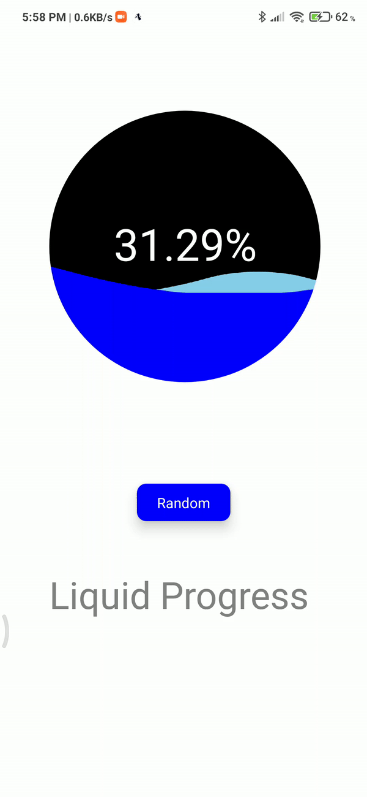

# Liquid Circular Progress

react native component Liquid Circular Progress for react native developers.This npm module is completly customizable and cool looking animations. hope this helps lot of us make your project even more cooler.

## Table of Contents

- [Installation](#installation)
- [Import](#import)
- [Usage](#usage)
- [Demo](#demo)

- [Props table](#props)
- [Support](#support)
- [Contributing](#contributing)

## Installation

`npm install react-native-liquid-progress`

## Import

`import { LiquidProgress } from react-native-liquid-progress`

## Usage

```javascript
import { StatusBar } from "expo-status-bar";
import React, { useState } from "react";
import {
  StyleSheet,
  Text,
  View,
  Animated,
  TouchableOpacity,
} from "react-native";
import LiquidProgress from "react-native-liquid-progress";

export default function App() {
  const [value, setValue] = useState(0);
  return (
    <View style={styles.container}>
      <LiquidProgress
        backgroundColor={"black"}
        frontWaveColor={"blue"}
        backWaveColor={"skyblue"}
        fill={value}
        size={290}
      >
        <Animated.View style={styles.row}>
          <Text style={styles.text}>{(value * 100).toFixed(2)}%</Text>
        </Animated.View>
      </LiquidProgress>
      <View style={styles.buttonLayer}>
        <TouchableOpacity
          style={styles.button}
          onPress={() => setValue(Math.random())}
        >
          <Text style={styles.buttonText}>Random</Text>
        </TouchableOpacity>
      </View>
      <Text style={styles.title}>Liquid Progress </Text>
      <StatusBar style="auto" />
    </View>
  );
}

const styles = StyleSheet.create({
  container: {
    flex: 1,
    backgroundColor: "#fff",
    alignItems: "center",
    justifyContent: "center",
  },
  row: {
    alignSelf: "center",
    flexDirection: "row",
    height: 70,
  },
  text: {
    color: "white",
    fontSize: 47,
  },
  buttonLayer: { flex: 0.25, flexDirection: "row" },
  button: {
    width: 100,
    height: 40,
    backgroundColor: "blue",
    justifyContent: "center",
    alignItems: "center",
    borderRadius: 10,
    margin: 30,
    elevation: 10,
  },
  buttonText: { fontSize: 15, color: "white" },
  title: { fontSize: 40, flex: 0.5, color: "gray" },
});
```

## Demo

[Click here to navigate to snack code example]("https://snack.expo.io/@vijaydemonz/react-native-liquid-progress")

**note**:its not comptaible for react-native web yet;



## Props table

| **prop**        | **description**                                                                 | **default** | **type**      | **required** |
| --------------- | ------------------------------------------------------------------------------- | ----------- | ------------- | ------------ |
| fill            | percentage of the progress to disply(0-1)                                       | 0.5         | Number        | yes          |
| size            | adjest size with`size`                                                          | 290         | Number        | yes          |
| backgroundColor | change backgroundColor                                                          | black       | hexcolor      | no           |
| frontWaveColor  | wave color of front wave                                                        | blue        | hexcolor      | no           |
| backWaveColor   | wave color of back wave                                                         | skyblue     | hexcolor      | no           |
| `children`      | to render what ever u need inside (refer usage section for clear understanging) | null        | JSX component | no           |

## Support

Please [open an issue](https://github.com/vijaydemonz/react-native-liquid-progress-npm/issues/new) for support.

## Contributing

Please contribute using [Github Flow](https://guides.github.com/introduction/flow/). Create a branch, add commits, and [open a pull request](https://github.com/vijaydemonz/react-native-liquid-progress-npm/compare/).
